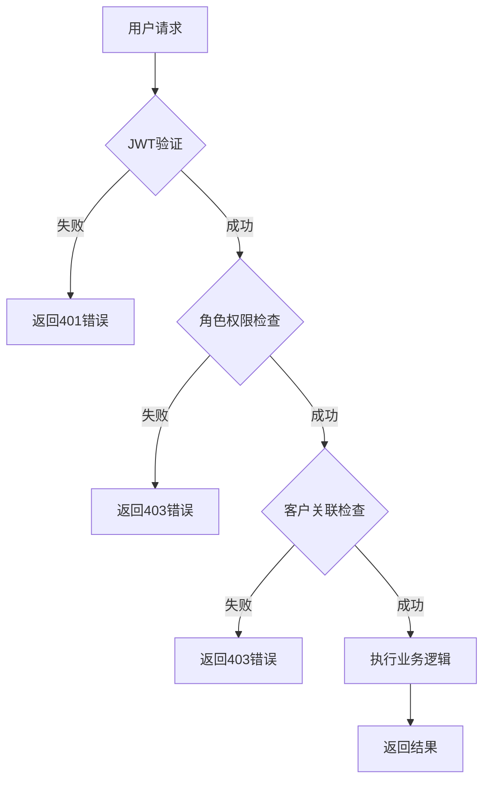

# 权限控制逻辑设计

## 1. 权限模型概述

系统采用基于角色的访问控制（RBAC）模型，结合客户关联权限控制，实现三层权限管理：

1. **超级管理员（admin）**：完全控制系统和权限分配
2. **客户经理（manager）**：控制指定客户的功能管理、运行、日志查看等
3. **操作员（operator）**：只能运行被分配客户所属的功能，查询日志等

## 2. 权限控制架构

### 2.1 权限验证层次
1. **路由层权限控制**：通过装饰器控制接口访问权限
2. **服务层权限控制**：在业务逻辑中进行二次权限验证
3. **数据层权限控制**：确保用户只能访问其权限范围内的数据

### 2.2 权限验证流程


## 3. 详细权限控制逻辑

### 3.1 超级管理员权限
超级管理员拥有系统最高权限，可以：
- 管理所有用户（增删改查）
- 管理所有客户数据
- 管理所有功能
- 查看所有日志和报表
- 分配权限给其他用户

### 3.2 客户经理权限
客户经理可以管理其关联客户的数据，包括：
- 管理关联客户的功能（增删改查）
- 运行关联客户的功能
- 查看关联客户的日志和报表
- 分配定时任务给关联客户的功能

### 3.3 操作员权限
操作员具有最基本的权限，可以：
- 运行被分配客户所属的功能
- 查看被分配客户的日志和报表
- 无管理权限（不能添加、修改、删除功能）

## 4. 权限控制实现

### 4.1 路由层权限控制

#### 角色权限装饰器
```python
from functools import wraps
from flask import request

def require_role(required_role):
    """
    角色权限装饰器
    :param required_role: 所需角色
    """
    def decorator(f):
        @wraps(f)
        def decorated_function(*args, **kwargs):
            # 检查用户是否已认证
            if not hasattr(request, 'current_user') or not hasattr(request, 'user_role'):
                return '未认证', 401
            
            # 检查角色权限
            user_role = request.user_role
            if user_role != 'admin':  # 超级管理员拥有所有权限
                if required_role == 'manager' and user_role != 'manager':
                    return '权限不足', 403
                if required_role == 'operator' and user_role not in ['operator', 'manager']:
                    return '权限不足', 403
            
            return f(*args, **kwargs)
        return decorated_function
    return decorator
```

#### 客户关联权限装饰器
```python
def require_customer_access():
    """
    客户关联权限装饰器
    确保客户经理只能访问其关联客户的数据
    """
    def decorator(f):
        @wraps(f)
        def decorated_function(*args, **kwargs):
            # 检查用户是否已认证
            if not hasattr(request, 'current_user') or not hasattr(request, 'user_role'):
                return '未认证', 401
            
            # 超级管理员可以访问所有客户数据
            if request.user_role == 'admin':
                return f(*args, **kwargs)
            
            # 客户经理只能访问其关联客户的数据
            if request.user_role == 'manager':
                # 获取请求中的客户ID
                customer_id = request.args.get('customer_id') or request.json.get('customer_id')
                if customer_id:
                    # 检查用户是否关联该客户
                    if not is_user_associated_with_customer(request.current_user.id, customer_id):
                        return '权限不足，无法访问该客户数据', 403
            
            return f(*args, **kwargs)
        return decorated_function
    return decorator
```

### 4.2 服务层权限控制

#### 功能管理权限控制
```python
def add_feature(name, description, customer_id, category_id, feature_file_name):
    """
    添加功能
    :param name: 功能名称
    :param description: 功能描述
    :param customer_id: 客户ID
    :param category_id: 分类ID
    :param feature_file_name: 功能文件名
    :return: (bool, str, dict) 是否成功，提示信息，功能数据
    """
    # 检查权限
    if request.user_role not in ['admin', 'manager']:
        return False, "权限不足", None
    
    # 客户经理只能添加关联客户的功能
    if request.user_role == 'manager':
        if not is_user_associated_with_customer(request.current_user.id, customer_id):
            return False, "权限不足，无法为该客户添加功能", None
    
    # 实现添加功能逻辑
    # ...

def update_feature(feature_id, name=None, description=None, customer_id=None, category_id=None):
    """
    更新功能
    :param feature_id: 功能ID
    :param name: 功能名称
    :param description: 功能描述
    :param customer_id: 客户ID
    :param category_id: 分类ID
    :return: (bool, str, dict) 是否成功，提示信息，功能数据
    """
    # 检查权限
    if request.user_role not in ['admin', 'manager']:
        return False, "权限不足", None
    
    # 获取原功能信息
    feature = Feature.query.get(feature_id)
    if not feature:
        return False, "功能不存在", None
    
    # 客户经理只能更新关联客户的功能
    if request.user_role == 'manager':
        if not is_user_associated_with_customer(request.current_user.id, feature.customer_id):
            return False, "权限不足，无法更新该客户的功能", None
        
        # 如果要更改客户，检查新客户是否关联
        if customer_id and customer_id != feature.customer_id:
            if not is_user_associated_with_customer(request.current_user.id, customer_id):
                return False, "权限不足，无法将功能转移到该客户", None
    
    # 实现更新功能逻辑
    # ...
```

#### 功能执行权限控制
```python
def execute_feature(feature_id, client_id):
    """
    执行功能
    :param feature_id: 功能ID
    :param client_id: 客户端ID
    :return: (bool, str, dict) 是否成功，提示信息，执行结果
    """
    # 获取功能信息
    feature = Feature.query.get(feature_id)
    if not feature:
        return False, "功能不存在", None
    
    # 操作员和客户经理只能执行关联客户的功能
    if request.user_role in ['operator', 'manager']:
        if request.user_role == 'operator':
            # 操作员只能执行被分配客户所属的功能
            if not is_user_associated_with_customer(request.current_user.id, feature.customer_id):
                return False, "权限不足，无法执行该客户的功能", None
        elif request.user_role == 'manager':
            # 客户经理只能执行关联客户的功能
            if not is_user_associated_with_customer(request.current_user.id, feature.customer_id):
                return False, "权限不足，无法执行该客户的功能", None
    
    # 实现功能执行逻辑
    # ...
```

### 4.3 数据层权限控制

#### 查询权限控制
```python
def get_features_for_user():
    """
    获取用户有权访问的功能列表
    :return: 功能列表
    """
    if request.user_role == 'admin':
        # 超级管理员可以查看所有功能
        return Feature.query.all()
    elif request.user_role == 'manager':
        # 客户经理只能查看关联客户的功能
        associated_customers = get_user_associated_customers(request.current_user.id)
        customer_ids = [c.id for c in associated_customers]
        return Feature.query.filter(Feature.customer_id.in_(customer_ids)).all()
    elif request.user_role == 'operator':
        # 操作员只能查看被分配客户所属的功能
        associated_customers = get_user_associated_customers(request.current_user.id)
        customer_ids = [c.id for c in associated_customers]
        return Feature.query.filter(Feature.customer_id.in_(customer_ids)).all()
    else:
        return []
```

## 5. 客户关联管理

### 5.1 客户关联验证
```python
def is_user_associated_with_customer(user_id, customer_id):
    """
    检查用户是否关联指定客户
    :param user_id: 用户ID
    :param customer_id: 客户ID
    :return: 是否关联
    """
    from app.models.user_models import UserCustomer
    association = UserCustomer.query.filter_by(user_id=user_id, customer_id=customer_id).first()
    return association is not None
```

### 5.2 获取用户关联的客户
```python
def get_user_associated_customers(user_id):
    """
    获取用户关联的客户
    :param user_id: 用户ID
    :return: 客户列表
    """
    from app.models.user_models import UserCustomer
    from app.models.base_models import Customer
    associations = UserCustomer.query.filter_by(user_id=user_id).all()
    customer_ids = [assoc.customer_id for assoc in associations]
    return Customer.query.filter(Customer.id.in_(customer_ids)).all()
```

## 6. 权限控制测试用例

### 6.1 超级管理员权限测试
1. 创建用户
2. 更新任意用户信息
3. 删除任意用户
4. 管理所有客户数据
5. 管理所有功能

### 6.2 客户经理权限测试
1. 只能管理关联客户的功能
2. 无法管理非关联客户的功能
3. 可以运行关联客户的功能
4. 无法运行非关联客户的功能

### 6.3 操作员权限测试
1. 只能运行被分配客户所属的功能
2. 无法管理任何功能
3. 可以查看被分配客户的日志

## 7. 安全考虑

### 7.1 权限验证
1. 在每个需要权限控制的接口上使用适当的装饰器
2. 在服务层进行二次权限检查
3. 防止越权访问客户数据

### 7.2 数据隔离
1. 客户经理只能看到和操作其关联客户的数据
2. 操作员只能执行被分配客户所属的功能
3. 超级管理员可以访问所有数据

### 7.3 防止权限提升
1. 普通用户无法将自己提升为超级管理员
2. 客户经理无法为非关联客户分配权限
3. 所有权限变更需要相应权限的用户操作

## 8. 性能优化

### 8.1 缓存用户关联信息
1. 在用户登录时缓存其关联的客户列表
2. 减少数据库查询次数
3. 提高权限验证效率

### 8.2 批量权限验证
1. 对于批量操作，一次性验证所有权限
2. 避免逐个验证权限导致的性能问题